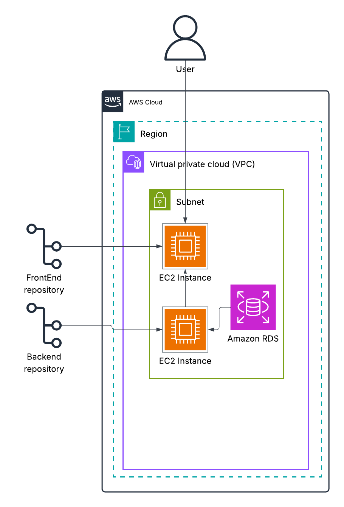

## Architecture Diagram 

The AWS architecture of **PocketBuddy** demonstrates how the personal finance management platform is securely deployed and managed within the AWS cloud ecosystem.

When a **User (Admin or Member)** accesses PocketBuddy via the web or mobile frontend, all HTTP requests are routed through the **AWS infrastructure**, hosted within a **Virtual Private Cloud (VPC)** to ensure isolation, scalability, and security.

- **Amazon ECS (Elastic Container Service):** Hosts the frontend and FastAPI backend responsible for managing transactions, analytics, and category-based expenses. ECS auto-scales containers based on traffic.
- **Amazon RDS (PostgreSQL):** Stores user accounts, family data, expense transactions, and category details. It ensures high availability, automatic backups, and ACID compliance.
- **Amazon CloudWatch:** Monitors application logs, tracks API performance, and provides real-time insights into ECS and RDS metrics.
- **AWS Secrets Manager:** Securely stores database credentials, JWT secrets, and API keys.

This architecture ensures **security**, **scalability**, and **continuous monitoring**, enabling PocketBuddy to provide a reliable and responsive expense management experience for families.

---
