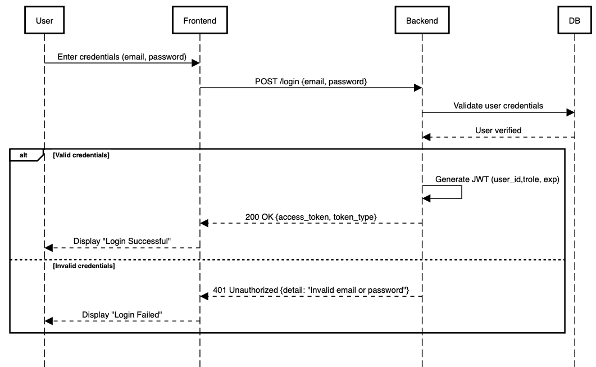

## Authentication and Authorization Explanation

The **Authentication and Authorization** mechanism in PocketBuddy manages secure access across different user roles — **Admin** and **Member**.

During login, a user provides their credentials (email and password), which are verified via the FastAPI backend. Upon successful validation:
- A **JWT (JSON Web Token)** is generated containing the user’s `user_id`, `user_name`,`family_id`, `role`, and expiration time.
- The token is sent to the frontend and securely stored (session/local storage).

For subsequent API calls, this token is attached in the request header and validated by the backend.

### Role-based Access Control (RBAC)
- **Admin:** Can add members, set category, and view all family transactions.
- **Member:** Can log personal expenses and view only their own reports.

If authentication fails, the backend responds with **HTTP 401 Unauthorized**, maintaining strict access control and data privacy.

This JWT-based stateless authentication ensures that every communication between frontend and backend is **secure**, **verified**, and **role-specific**.

