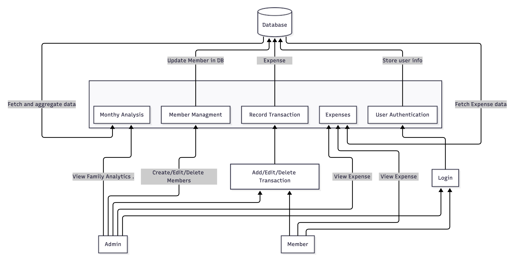

## Data Flow Diagram (DFD)

The **Data Flow Diagram (DFD)** of **PocketBuddy** illustrates how information flows between different entities — **Admin**, **Members**, and the internal system components. It provides a clear view of how user actions interact with the backend modules and the central database.

In PocketBuddy, the system is composed of five main functional modules, each performing specific operations and communicating with the database to ensure data consistency and synchronization:

**Member Management:**  

  - Allows the **Admin** to create or edit family members.  
  - Updates member information in the database.  
  - Ensures proper linkage of each member to their respective family group.

**User Authentication:**  

  - Handles secure login and registration for both **Admin** and **Members**.  
  - Stores verified user credentials and issues authentication tokens (JWT).  
  - Stores user information securely in the database.

**Transaction Recording:** 

  - Enables both **Admin** and **Members** to add or edit financial transactions.  
  - Each transaction is stored in the database.  
  - Supports updates and retrievals for real-time tracking.

**Monthly Analysis:**  

  - Aggregates and fetches transaction data from the database.  
  - Performs data summarization for monthly or category-wise spending.  .

**Expenses Module:**  

  - Fetches expense data from the database for both **Admin** and **Members**.  
  - Displays detailed spending records and allows filtering by category or time range.  
  - Works closely with the Monthly Analysis module to provide accurate summaries.

