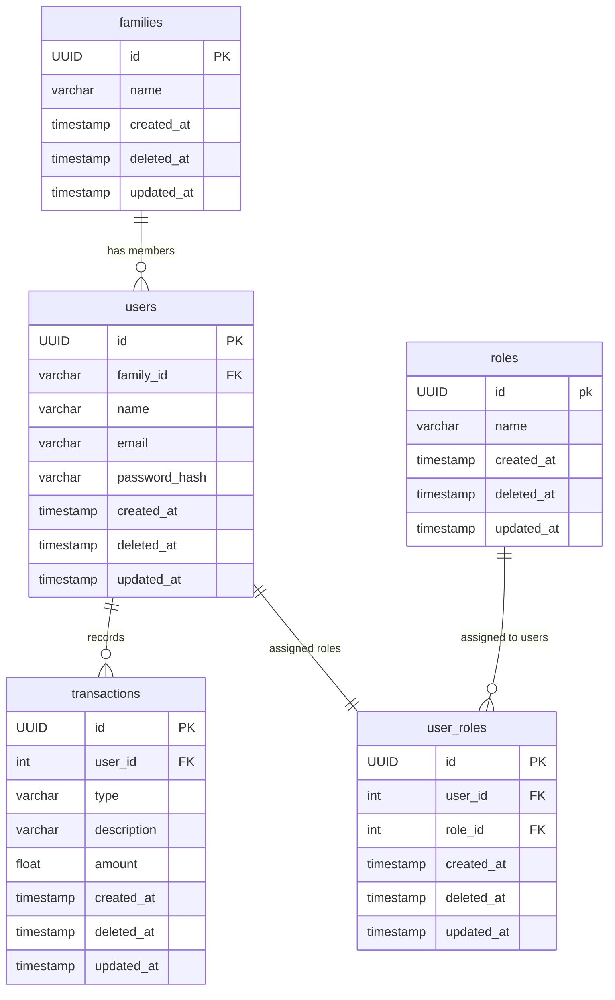

## Entity Relationship Diagram

## Database Tables

### 1. users
Stores user login information.

**Fields:**

- `id` - Unique user ID
- `family_id` - To connect user to family
- `name` - Login username
- `email` - Personal email 
- `password_hash` - Encrypted password
- `created_at ` - Time at which user is created 
- `deleted_at` - Time at which user is deleted
- `updated_at` - Last Time at which user is updated

---

### 2. transactions
Stores all transactions information.

**Fields:**

- `id` - Unique transactions ID
- `user_id` - Unique user ID which made the transactions
- `type` - transactions type (e.g., Need, Luxury)
- `amount` - amount of transaction
- `description` - transactions details(optional)
- `created_at ` - Time at which transactions is created 
- `deleted_at` - Time at which transactions is deleted
- `updated_at` - Last Time at which transactions is updated

---

### 3. families
Stores user family information.

**Fields:**

- `id` - Unique family ID
- `name` - Name of the family
- `quantity` - Current stock level
- `created_at ` - Time at which family is created 
- `deleted_at` - Time at which family is deleted
- `updated_at` - Last Time at which family is updated

--- 

### 4. roles
Stores role information.

**Fields:**

- `id` - Unique role ID
- `name` - Type of role(e.g., Head,Member)
- `created_at ` - Time at which role is created 
- `deleted_at` - Time at which role is deleted
- `updated_at` - Last Time at which role is updated

### 5. uses_roles
Stores user role information.

**Fields:**

- `id` - Unique ID
- `user_id` - Unique user ID
- `role_id` - Unique role id
- `created_at ` - Time at which role is created 
- `deleted_at` - Time at which role is deleted
- `updated_at` - Last Time at which role is updated
---