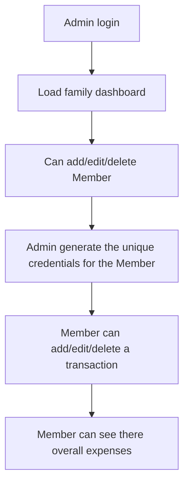

## Modules

### 1. Authentication and Family Management
- Admin (head of family) registers the family account.  
- Admin can create login credentials (user ID and password) for each family member.  
- Family members log in using their assigned credentials.  
- Secure authentication using JWT login.

### 2. Member Dashboard
  - Add expenses manually.  
  - Categorize each transaction (Food, Bills, Education, Travel, etc.).  
  - View their individual spending summaries.
  - Edit or delete entries if required. 

### 3. Family Dashboard (Admin View)
  - View total family expenses.  
  - View spending breakdown by category and by member.  
  - Edit or delete member entries if required.  
  - Add or remove family members.  
<!-- 
### 4. Analytics and Reports
- Pie charts showing spending by category (Food, Needs, Miscellaneous, etc.).  
- Bar charts comparing monthly spending between family members.  
- Overview of savings and total expenditure. -->

### 4. Budget Planning (Optional)
- Admin can set monthly or category-wise budgets for the entire family.  
- System tracks progress and alerts when nearing limits.

---

## Flow Diagram
